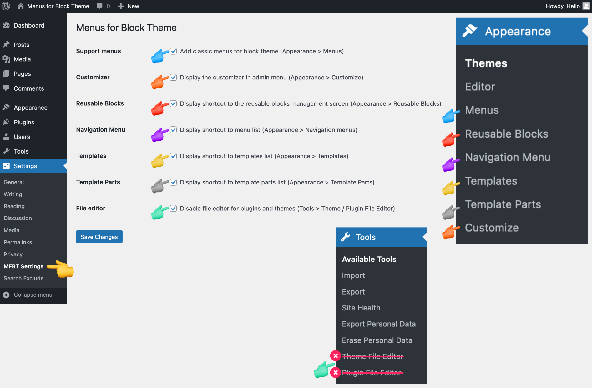
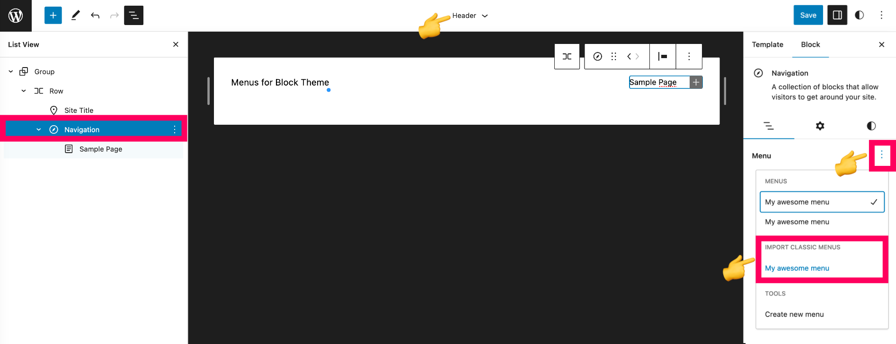
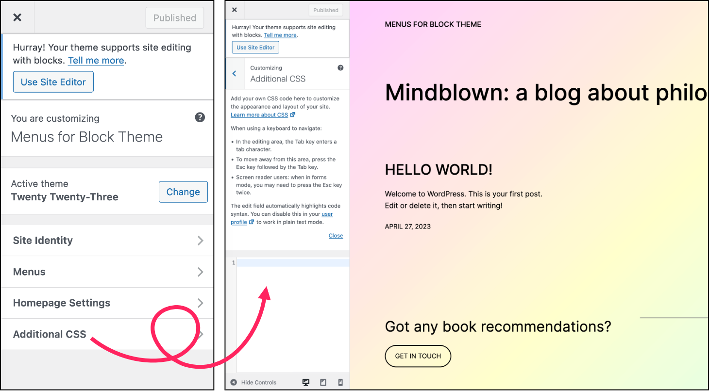

# WordPress Plugin : Menus for Block Theme

**Contributors: lyly13, wpr0ck**

WordPress repo: [https://wordpress.org/plugins/menus-for-block-theme/](https://wordpress.org/plugins/menus-for-block-theme/)

__Menus for Block Theme__ add a setting page in the WordPress dashboard (Settings > MFBT Settings) which allows managing the following options :

## 1 - Add classic menus in block themes (Add menus to theme supports)

Support menus in WordPress provide users with an easy way to create and manage menus directly from the WordPress dashboard. **This is very useful if your block-based theme doesn't support classic menus**.

_Appearance -> Menus_

## 2 - Display shortcut to the reusable blocks management screen

Add a link in the WordPress dashboard to access quickly the Reusable Blocks Screen. **This is very useful if you want to manage your reusable blocks without editing a post**

_Appearance > Reusable Blocks_

## 3 - Display shortcut to menu list

Add a link in the WordPress dashboard to access the Navigation Menus sceen. **This is very useful only if you want to delete some menus**

_Appearance > Navigation menus_

## 4 - Display shortcut to templates list

Add a link in the WordPress dashboard to access quickly the Template list screen. **This is very useful if you want to add or manage a template and you don't want to have many click to access**

_Appearance > Templates_

## 5 - Display shortcut to template parts list

Add a link in the WordPress dashboard to access quickly the Template Parts list screen. **This is very useful if you want to add or manage a Template Part and you don't want to have many click to access**

_Appearance > Template Parts_

## 6 - Display the customizer in admin menu

Add a link in the WordPress dashboard to access the customizer. A space to configure the site identity (Site title, Tagline, Site icon), The menus (Add new, Menus locations, Menus Options), the Homepage Settings (display latest posts or static page) and add additional CSS. **This is very useful if your block-based theme does not display the tab that allows you to add your custom CSS styles**

_Appearance -> Customize_

## 7 - Disable files editor for plugins and themes

**Improve security and reduce the risk of potential vulnerabilities**. By disabling the file editor, WordPress administrators are forced to make changes to the code using a more secure method, such as editing the files locally and then uploading them to the server via FTP, or using a plugin to manage code changes.

_Tools -> Theme file editor_ and _Tools -> Plugin file editor_

## Screenshots

### Settings page

### Add classic menus support

### Add Customizer support

### Disable Files Editor from admin

### Shortcut to Reusable Blocks screen

### Shortcut to Navigation Menu screen

### Shortcut to All Template Screen

### Shortcut to All Template Part Screen

### Tutorial to create classic menus and import them into a Site Editor template part

## Changelog

### 1.0.0

* Add french translation
* Add setting : Menus support
* Add setting : Customize support
* Add setting : Disallow file edit
* Add setting : Reusable Blocks screen
* Add setting : Navigation Menu screen
* Add setting : Template screen
* Add setting : Template Parts screen
